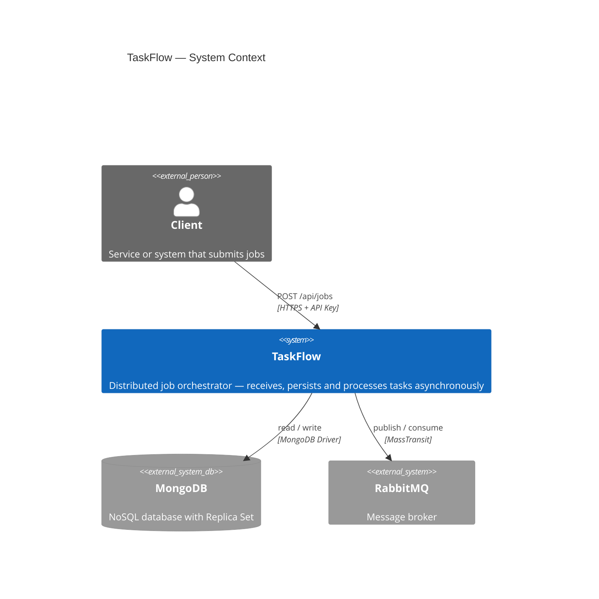
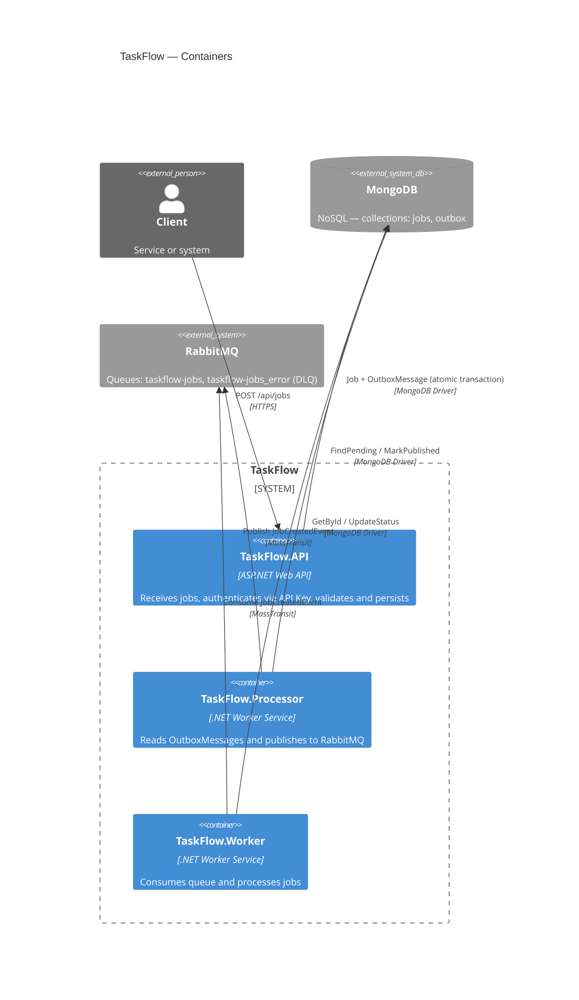
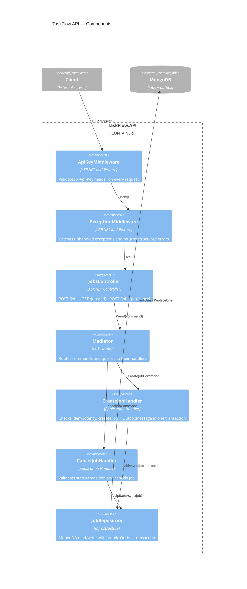

# TaskFlow — Arquitetura

## 1. Visão Geral

O TaskFlow é um orquestrador de jobs distribuído de alta disponibilidade. O objetivo é receber tarefas via API, garantir que nenhuma seja perdida mesmo em caso de falha de infraestrutura, e processá-las de forma assíncrona e resiliente.

O sistema foi desenhado para receber milhares de requisições por minuto garantindo consistência entre persistência e publicação na fila, processamento ordenado por prioridade e rastreabilidade completa do ciclo de vida de cada job.

---

## 2. Stack Tecnológica

| Tecnologia | Uso |
|---|---|
| .NET 8 LTS | Runtime — versão LTS escolhida por estabilidade e suporte de longo prazo |
| MongoDB | Banco NoSQL com Replica Set — necessário para transações multi-documento (padrão Outbox) |
| RabbitMQ | Message broker — transporta mensagens entre Processor e Worker |
| MassTransit | Abstração sobre RabbitMQ — gerencia conexões, exchanges, filas e DLQ automaticamente |
| Mediator (MIT) | Padrão Mediator para CQRS — escolhido por licença MIT (MediatR é pago para uso comercial a partir da v12) |
| FluentValidation | Validação de entrada via ValidationBehavior no pipeline do Mediator |
| Polly | Retry com backoff exponencial e Circuit Breaker para publicação no RabbitMQ |
| Serilog | Logs estruturados com enriquecimento de contexto e suporte a múltiplos sinks |
| Docker Compose | Orquestração local de containers — MongoDB com Replica Set e RabbitMQ |

---

## 3. Estrutura da Solução

Clean Architecture com separação estrita de camadas. Cada projeto tem uma responsabilidade única e as dependências seguem uma regra sem exceções.

| Projeto | Tipo | Responsabilidade |
|---|---|---|
| TaskFlow.API | ASP.NET Web API | Ponto de entrada — Controllers, Middlewares, autenticação via API Key |
| TaskFlow.Application | Class Library | Casos de uso — Commands, Queries, Handlers, ValidationBehavior, DTOs |
| TaskFlow.Domain | Class Library | Núcleo — Entidades, Enums, Exceções, Interfaces de repositório |
| TaskFlow.Infrastructure | Class Library | Implementação técnica — Repositories, Documents, Mappers, MongoDB, MassTransit |
| TaskFlow.Processor | Worker Service | Serviço independente — lê Outbox do MongoDB e publica no RabbitMQ |
| TaskFlow.Worker | Worker Service | Serviço independente — consome fila do RabbitMQ e processa os jobs |
| TaskFlow.Tests | xUnit | Testes unitários cobrindo Domain e Application |

### Regra de dependência

A regra é simples e não tem exceção: o Domain não depende de ninguém. Tudo depende do Domain, nunca o contrário.

```
Domain        → sem dependências externas
Application   → Domain only
Infrastructure → Domain only
API           → Application + Infrastructure
Processor     → Infrastructure
Worker        → Infrastructure
Tests         → Domain + Application
```

---

## 4. Fluxo de Processamento

O fluxo foi desenhado para garantir que nenhum job seja perdido, mesmo em caso de falha de qualquer componente. A chave é o padrão Outbox com transação atômica.

### Fluxo completo

1. Cliente envia `POST /api/jobs` com header `Idempotency-Key` e payload
2. API autentica (API Key), valida (FluentValidation) e envia para o Handler via Mediator
3. Handler verifica idempotência — se a chave já existe, retorna o job existente (`HTTP 200` + `alreadyExisted: true`)
4. Handler cria Job + OutboxMessage na mesma transação MongoDB — os dois salvam ou nenhum salva
5. API retorna `HTTP 201` com `jobId` — processamento é assíncrono
6. `OutboxProcessorService` (BackgroundService) lê mensagens pendentes a cada N segundos
7. Processor ordena por prioridade (High primeiro) e publica no RabbitMQ via MassTransit
8. Após publicação bem-sucedida, Processor marca OutboxMessage como Published
9. Worker consome a mensagem do RabbitMQ, busca o Job completo no MongoDB e processa
10. Worker atualiza status: `Running` → `Completed` ou `Failed`

### Ciclo de vida do Job

| Status | Quando |
|---|---|
| `Pending` | Job criado pela API — aguardando publicação no RabbitMQ |
| `Running` | Worker recebeu a mensagem e iniciou o processamento |
| `Completed` | Worker concluiu o processamento com sucesso |
| `Failed` | Worker encontrou erro — job pode ser retentado via DLQ |
| `Cancelled` | Cancelado via `POST /api/jobs/{id}/cancel` — aceito apenas em Pending ou Running |

---

## 5. Decisões Arquiteturais (ADR)

### ADR-01 — MongoDB com Replica Set

O padrão Outbox exige que Job e OutboxMessage sejam salvos na mesma transação atômica. O MongoDB só suporta transações multi-documento em modo Replica Set — mesmo em desenvolvimento local com um único nó.

**Alternativa descartada:** salvar Job e OutboxMessage em operações separadas sem transação. Isso cria uma janela de falha onde o Job é salvo mas a OutboxMessage não — o job nunca chegaria na fila. Perda silenciosa de dados — inaceitável.

### ADR-02 — Padrão Outbox

A API nunca publica diretamente no RabbitMQ. Ela salva uma OutboxMessage no banco junto com o Job (mesma transação). Um processo separado (Processor) lê as mensagens pendentes e publica no broker.

**Alternativa descartada:** publicar diretamente no RabbitMQ após salvar no banco. Se a aplicação cair entre os dois passos, o job é salvo mas nunca processado.

### ADR-03 — Mediator (MIT) em vez de MediatR

O MediatR a partir da versão 12 exige licença paga para uso comercial. O Mediator é uma alternativa MIT com API similar e performance superior via source generators. A escolha foi pragmática — sem dependência de licença e mais performático.

### ADR-04 — Concorrência distribuída via MassTransit

O documento do desafio menciona lock distribuído como opção. Optei por garantir a concorrência pelo design da fila: o RabbitMQ com MassTransit entrega cada mensagem para exatamente um consumidor (competing consumers pattern). Não há necessidade de lock manual.

**Alternativa descartada:** lock distribuído via MongoDB. Adiciona complexidade sem benefício real dado o design do broker.

### ADR-05 — Idempotência via Idempotency-Key

O cliente gera uma chave única por requisição e a envia no header `Idempotency-Key`. O Handler verifica se a chave já existe antes de criar o job. Se existir, retorna o job existente com `alreadyExisted: true` e `HTTP 200`. Se não existir, cria e retorna `HTTP 201`. Essa abordagem é segura para retentativas do cliente sem criar duplicatas.

### ADR-06 — NoSQL para armazenamento

MongoDB foi escolhido por dois motivos: o payload de cada job é livre (cada `jobType` tem campos diferentes) e o requisito de alta volumetria favorece um banco que escala horizontalmente. O modelo de documentos JSON elimina a necessidade de schemas rígidos para os payloads.

### ADR-07 — API Key como autenticação

O sistema é um orquestrador consumido por outros serviços, não por usuários humanos. API Key é adequada para comunicação máquina a máquina (M2M), simples de implementar e suficiente para o escopo. JWT seria mais adequado se houvesse um portal web com usuários se autenticando.

### ADR-08 — Processor e Worker como projetos independentes

Cada componente tem seu próprio ciclo de vida independente. O Processor pode escalar separado da API se o volume de publicações aumentar. O Worker pode escalar separado se o processamento for o gargalo. Projetos separados também facilitam a rastreabilidade via logs — cada processo tem seu próprio `Application` property no Serilog.

---

## 6. Resiliência

### Circuit Breaker + Retry (Polly)

O Processor envolve cada publicação no RabbitMQ com um pipeline Polly. O Retry tenta até 3 vezes com backoff exponencial e jitter. O Circuit Breaker abre quando mais de 50% das chamadas falham em 30 segundos, parando completamente as tentativas por 30 segundos antes de testar a recuperação.

```
Falha → Retry 1 (2s) → Retry 2 (4s + jitter) → Retry 3 (8s + jitter) → CB avalia
50%+ falhas em 30s → Circuit Breaker ABRE → publishing pausado por 30s
Após 30s → HALF-OPEN → testa → sucesso → CLOSED → retoma
```

### Dead Letter Queue (DLQ)

O MassTransit configura a DLQ automaticamente. No Worker, após 3 tentativas com intervalos crescentes (5s, 15s, 30s), mensagens que continuam falhando são movidas para a fila `taskflow-jobs_error`. Essas mensagens podem ser inspecionadas e reprocessadas pelo painel do RabbitMQ.

### At-least-once delivery

O Processor marca a OutboxMessage como Published apenas após publicação bem-sucedida. Se o processo cair entre publicar e marcar, a mensagem será reprocessada no próximo ciclo. O Worker trata esse cenário com uma guarda de idempotência: verifica o status do job antes de processar e ignora jobs que não estejam em `Pending`.

---

## 7. Observabilidade

### Logs estruturados

Serilog está configurado nos três projetos: API, Processor e Worker. Em Development usa formato texto legível com template customizado. Em Production usa JSON compacto (CompactJsonFormatter). Cada log é enriquecido com o `Application` name para facilitar filtragem.

### Health Check

O endpoint `GET /health` verifica MongoDB e RabbitMQ. O resultado inclui o status de cada dependência individualmente. Usado pelo Docker Compose para determinar se o container está saudável antes de iniciar dependentes.

---

## 8. Limitações Conhecidas

### GetAllJobs sem paginação

O endpoint `GET /api/jobs` retorna todos os jobs sem limite ou paginação. Em produção com alto volume isso pode ser um problema de performance. A paginação foi identificada como evolução futura — a alteração é localizada (Query + Repository + MongoDB query) e não afeta outras camadas.

### Testes de integração

Os testes atuais são unitários — cobrem Domain e Application com mocks via NSubstitute. Testes de integração com MongoDB e RabbitMQ reais via TestContainers foram identificados como próxima evolução, especialmente para validar o fluxo completo e cenários de concorrência.

### Processamento de jobs

O Worker atual simula o processamento com `Task.Delay(100ms)`. A lógica real de cada `jobType` (SendEmail, GenerateReport, etc.) seria implementada como handlers específicos. O design atual suporta isso via switch/strategy no Consumer sem necessidade de alterações estruturais.

---

## 9. Infraestrutura Local

### Docker Compose

O ambiente local sobe MongoDB com Replica Set de um único nó (`rs0`) e RabbitMQ com Management Plugin. O MongoDB requer Replica Set mesmo localmente para suportar transações — requisito técnico do padrão Outbox.

```bash
docker-compose up -d
```

| Serviço | Endereço |
|---|---|
| MongoDB | localhost:27017 (replica set: rs0) |
| RabbitMQ broker | localhost:5672 |
| RabbitMQ management | localhost:15672 (guest/guest) |
| API | localhost:8080/swagger |

### Problema conhecido — inicialização do Replica Set

Em alguns ambientes o container `mongo-init` pode falhar ao inicializar o Replica Set automaticamente. Sintoma: API retorna `MongoNotPrimaryException`. Solução manual documentada no `DOCKER.md`.

---

## 10. Endpoints da API

Todos os endpoints requerem o header `X-Api-Key`.

| Método | Rota | Descrição |
|---|---|---|
| `POST` | `/api/jobs` | Cria um novo job. Suporta idempotência via header `Idempotency-Key` |
| `GET` | `/api/jobs/{id}` | Retorna um job pelo ID com status atual |
| `GET` | `/api/jobs` | Lista todos os jobs (sem paginação — limitação conhecida) |
| `POST` | `/api/jobs/{id}/cancel` | Cancela um job em Pending ou Running |
| `GET` | `/health` | Health check de MongoDB e RabbitMQ |


## C4 Diagram

### Level 1 — System Context



---

### Level 2 — Containers



---

### Level 3 — Components (API)

